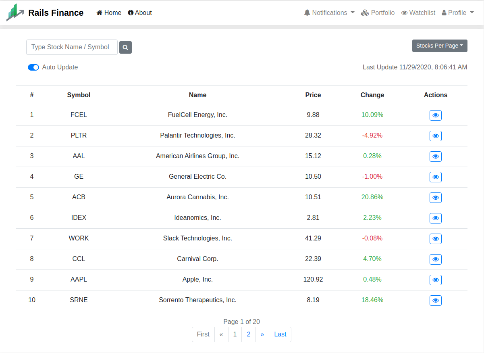
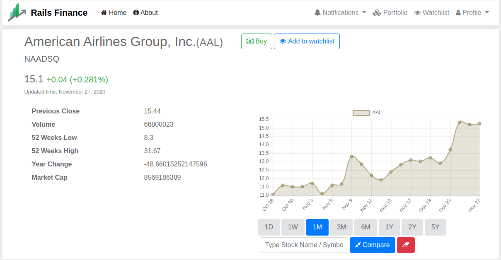
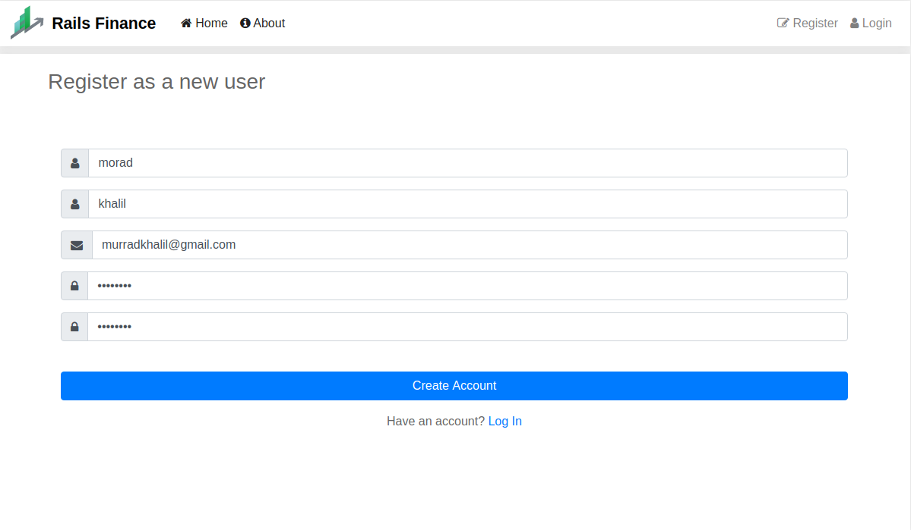
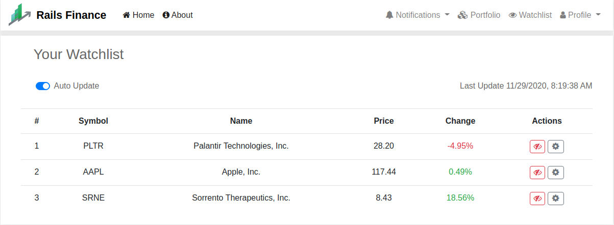
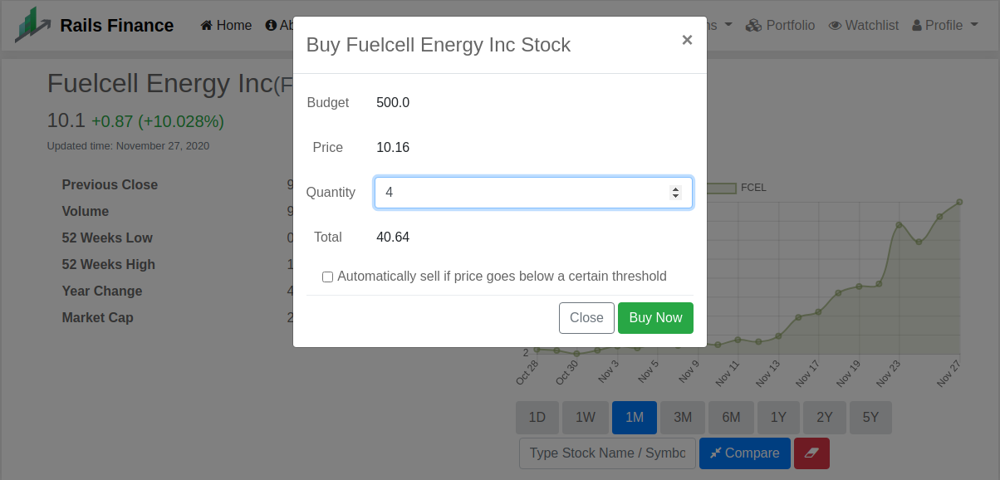
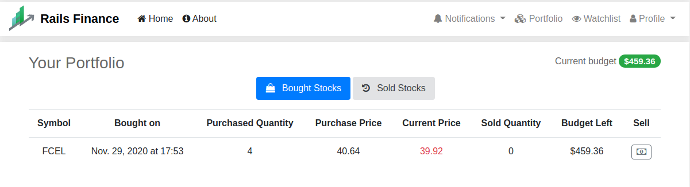
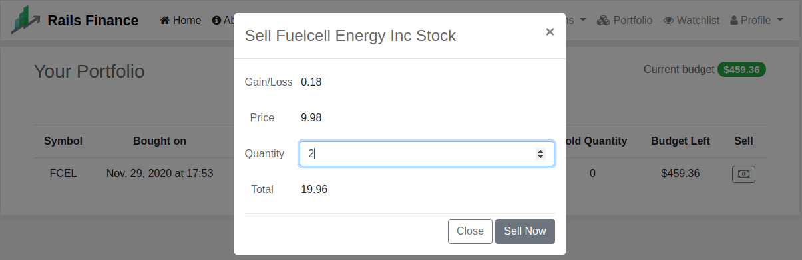
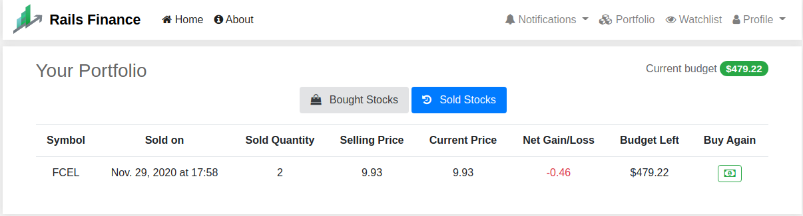
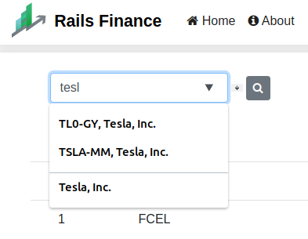
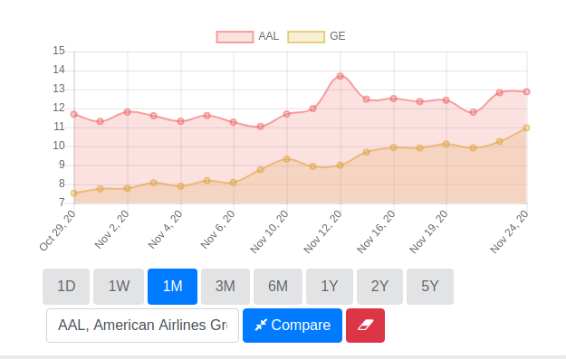

# Stock Project
## OverView
Our Project had built as part of Project-rails course, designed  
using different technologies, for backend we used Python (Django-framework)  
and bash scripting, for frontend used javascript and html, and Database used MySQL,  
and hosted into aws server. 
the main idea of stock-project is to enable the investors and stock traders  
to maximize their profits.  
#### Main Features
- Ability to track/watch particular stocks in real-time update.
- Comparing multiple stocks on one graph. 
- Adding notification rules to tracked/watched stock, like to notify when price of  
stock reaches Above/Below/On specific threshold, or when stock has a  
Positive/Negative change in price in the last X days, or when it's recommender   
to buy/sell/hold the stock (based on external recommendation-analyst service).    
- Buy and sell stocks and to increase/decrease user budget (simulated bank accounts).  
- Historic stocks transaction tracking, with amount of net profits gained by 
this transaction.

## Future Features
* [ ] Automation for buy/sell threshold price, i.e. a new rule   
to buy or to sell a stock when specific price threshold reached
* [ ] Automation for Stop-losing, to sell the stock when price goes   
below certain threshold.
* [X] Adding WSGI Gunicorn as a production server.
* [X] Dockerizing each app componentes (creating Images for application-code & Nginx & MySqlDB)

## ScreenShots
##### Main Page

##### Single Stock Page

##### Registration Page

##### WatchList Page

##### Buy Form

##### Portfolio Page

##### Sell Form

##### Portfolio Page

##### Real-time Auto-complete Search

##### Stocks Change Comparison

## How To Run
- cloning github repository into local machine
- installing requirement packages `pip install -r requirements.txt`  
- setting up database: see the related readme file in `myrails/configuration/Readme.md`  
- run `python manage.py migrate` to initialize the DB
- run `python manage.py runserver`.

